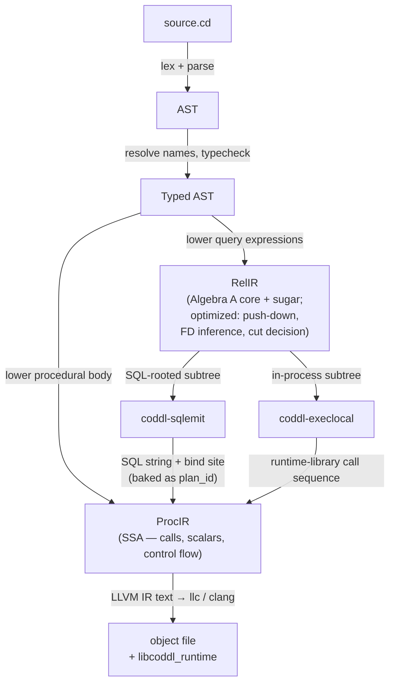

# Coddl docs

Coddl is a compiler for a relational language conforming to Date and Darwen's *Third Manifesto*. Query fragments compile to SQL and run against a pluggable storage backend (SQLite first, Postgres later); everything else compiles to LLVM IR and links against a small Rust runtime exposed through C ABI.

Coddl is its own D — not Tutorial D. It conforms to TTM's RM/OO Prescriptions and Proscriptions (see [conformance.md](conformance.md)) and designs its own surface syntax, IRs, and runtime around the four [principles](principles.md).

## Pipeline



Plain-text fallback (same shape):

```
source.cd → AST → Typed AST
                     │
                     ├──► (procedural body) ─────────────────────────────► ProcIR
                     │                                                       ▲
                     └──► RelIR ──► optimize (push-down, FD inference,        │
                                    storage-origin cut)                      │
                                       │                                     │
                                       ├──► coddl-sqlemit ──► SQL + plan_id ─┤
                                       │                                     │
                                       └──► coddl-execlocal ──► call seq ────┘
                                                                             │
                                                                             ▼
                                                                  LLVM IR text → llc / clang
                                                                  → object file
                                                                  → libcoddl_runtime
```

RelIR sits **above** ProcIR; it's where the relational algebra lives and where the SQL/in-process cut is drawn. Each RelIR subtree is consumed by exactly one of two crates — `coddl-sqlemit` for SQL-rooted subtrees, `coddl-execlocal` for in-process subtrees — both of which emit into ProcIR. ProcIR is procedural SSA; it knows nothing about algebra. See [relir.md](relir.md) and [procir.md](procir.md) for the full story.

The diagram above stops at codegen. For the **full target architecture** — including the runtime engines and exactly what triggers a SQL call to SQLite/Postgres (a relvar-rooted relation being *forced*) — see [architecture.dot](architecture.dot) (rendered: [architecture.svg](architecture.svg)). Regenerate the SVG with `dot -Tsvg docs/architecture.dot -o docs/architecture.svg`.

Every frontend pass also returns a `Vec<Diagnostic>` alongside its (possibly partial) output — the CLI driver renders them to the terminal; `coddl-lsp` serializes them as `PublishDiagnostics`. The pipeline above is the happy path; on the unhappy path, partial results and diagnostics flow back together rather than the pipeline halting. See [lsp.md](lsp.md).

## Where to look

**Start here:**

- **[principles.md](principles.md)** — the four core principles. Every design decision traces back to these.
- **[conformance.md](conformance.md)** — RM/OO Pre/Pro adoption tables, VSS schedule, sanctioned design freedoms. The non-negotiables.

**Subsystem docs:**

| Doc | Subject |
|---|---|
| [grammar.md](grammar.md) | Surface syntax — lexer, parser, every production, comments, identifiers, literals, methods, glyphs |
| [typecheck.md](typecheck.md) | Type system — possreps, headings, generators, `reltrue` / `relfalse`, type / constraint inference |
| [prelude.md](prelude.md) | The builtin surface in Coddl source — the `builtin` qualifier, signatures loaded from `coddl::core` (embedded in `coddl-stdlib`) |
| [relir.md](relir.md) | RelIR — Algebra A core, sugar layer, storage-origin flag, the SQL vs in-process cut |
| [procir.md](procir.md) | ProcIR — procedural SSA, runtime call sites, no relational algebra |
| [sqlemit.md](sqlemit.md) | `coddl-sqlemit` — RelIR → SQL, mandatory emission rules, dialect surface |
| [storage.md](storage.md) | Storage abstraction — `Backend` / `Conn` traits, materializing in-memory relations |
| [plan.md](plan.md) | `.cd` / `.cddb` / `.cdmap` / `.cdstore` separation; the `database` declaration |
| [runtime.md](runtime.md) | `libcoddl_runtime` — C ABI, two execution engines, two pathways, lazy semantics, transactions, multi-assign |
| [codegen.md](codegen.md) | ProcIR → LLVM IR text (v1), Cranelift / wasm-encoder (planned) |
| [driver.md](driver.md) | `coddl` CLI — `compile`, `run`, `repl`, `fmt` |
| [lsp.md](lsp.md) | `coddl-lsp` language server + VSCode extension; frontend discipline |
| [fmt.md](fmt.md) | Code formatter — CST traversal, formatting rules, edition versioning |
| [memory.md](memory.md) | Memory model — refcount + COW + persistent data + per-scope arenas; no GC, no borrow checker |
| [workspace.md](workspace.md) | Cargo workspace layout — one crate per subsystem |

**Project state:**

| Doc | Subject |
|---|---|
| [milestone.md](milestone.md) | First end-to-end milestone — the work plan |
| [webhost.md](webhost.md) | Web host — compiled Coddl behind an HTTP server; the `coddl::web` `Request`/`Response` vocabulary + `coddl-web` host plan |
| [risks.md](risks.md) | Open design decisions worth tracking |
| [validation.md](validation.md) | Cross-backend equivalence matrix |

**Companion file grammars:**

| Doc | Subject |
|---|---|
| [cddb-grammar.md](cddb-grammar.md) | `.cddb` database catalog grammar |
| [cdmap-grammar.md](cdmap-grammar.md) | `.cdmap` mapping file grammar |
| [cdstore-grammar.md](cdstore-grammar.md) | `.cdstore` physical-binding grammar |

## Reading order for new contributors

1. [principles.md](principles.md) — the lens
2. [conformance.md](conformance.md) — the contract
3. This file's pipeline diagram (above)
4. [grammar.md](grammar.md) — the surface (what users type)
5. [relir.md](relir.md) + [procir.md](procir.md) — the IRs (what the compiler thinks about)
6. [runtime.md](runtime.md) — what runs at runtime
7. Whichever subsystem you're working in
